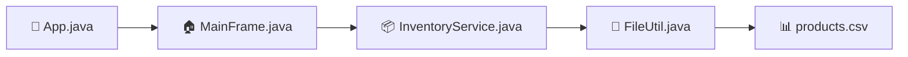
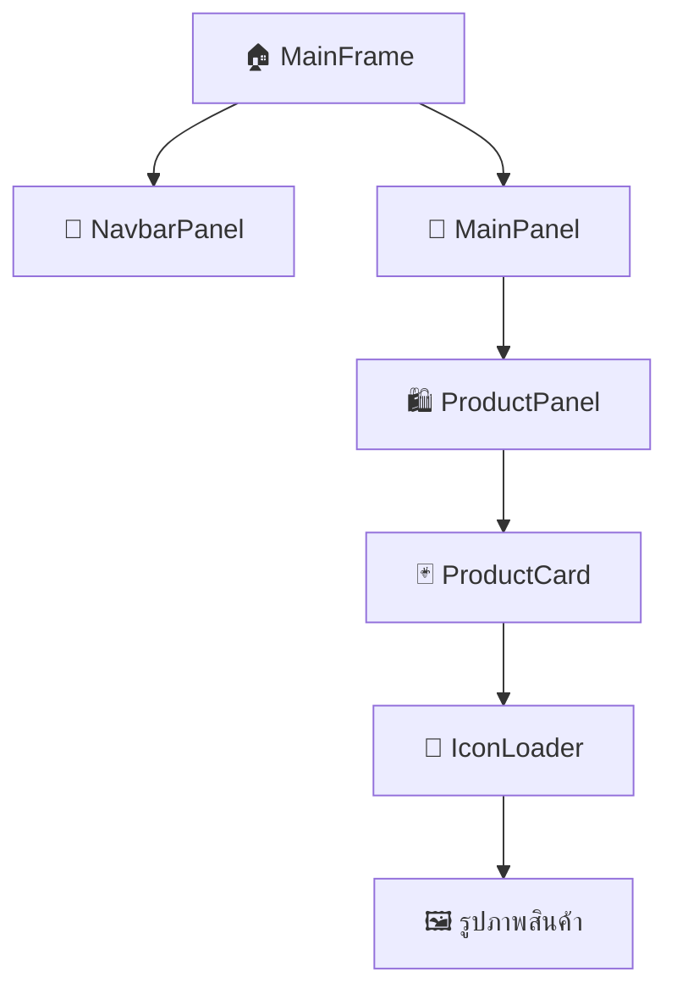
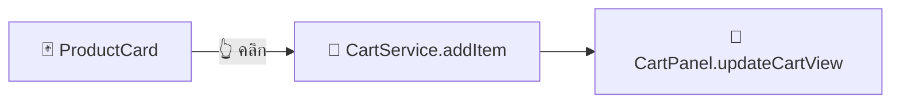
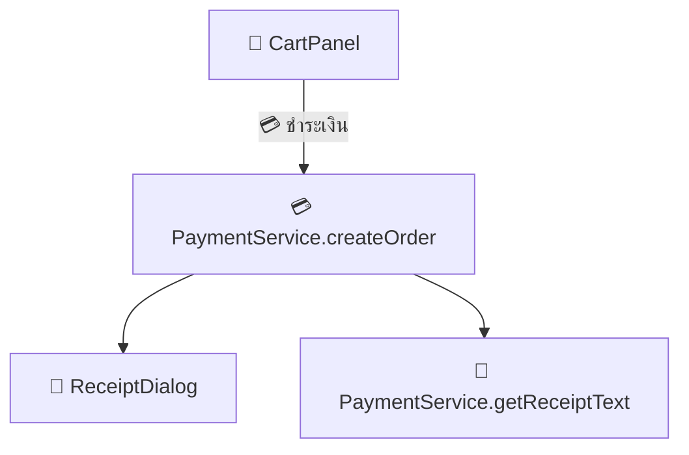
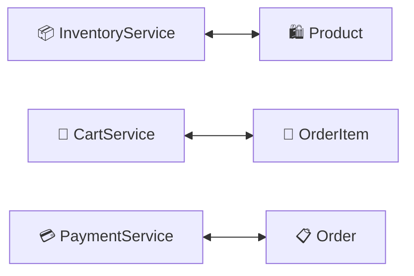

<div align="center">

# 🍽️ ระบบ POS (Point of Sale) สำหรับร้านอาหาร 🏪

[](https://www.java.com/)
[](https://docs.oracle.com/javase/tutorial/uiswing/)
[](https://en.wikipedia.org/wiki/Comma-separated_values)
[](LICENSE)

*ระบบจัดการการขายที่ทันสมัยและใช้งานง่าย สำหรับร้านอาหารขนาดเล็กถึงกลาง*

</div>

---

## 📋 สารบัญ

- [🎯 ภาพรวมของระบบ](#-ภาพรวมของระบบ)
- [🏗️ โครงสร้างโปรเจค](#️-โครงสร้างโปรเจค)
- [⚙️ การทำงานของแต่ละไฟล์](#️-การทำงานของแต่ละไฟล์)
- [🔄 การทำงานร่วมกันของระบบ](#-การทำงานร่วมกันของระบบ)
- [📊 Diagram การทำงานของระบบ](#-diagram-การทำงานของระบบ)
- [✨ ฟีเจอร์หลักของระบบ](#-ฟีเจอร์หลักของระบบ)
- [🚀 การรันโปรแกรม](#-การรันโปรแกรม)
- [🏛️ สถาปัตยกรรมของระบบ](#️-สถาปัตยกรรมของระบบ)

---

## 🎯 ภาพรวมของระบบ

> 💡 **ระบบ POS ที่ออกแบบมาเพื่อความง่ายและประสิทธิภาพ**

ระบบ POS นี้เป็นแอปพลิเคชันที่พัฒนาด้วยภาษา **Java** และใช้ **Swing** สำหรับส่วนติดต่อผู้ใช้ (GUI) เพื่อจัดการการขายสินค้าในร้านอาหาร 

### 🌟 จุดเด่นของระบบ
- 🖥️ **GUI ที่ใช้งานง่าย** - ออกแบบมาให้ใช้งานง่าย เหมาะสำหรับพนักงานทุกระดับ
- 🛒 **จัดการตะกร้าสินค้า** - เพิ่ม ลบ แก้ไขสินค้าได้อย่างรวดเร็ว
- 💰 **ระบบชำระเงิน** - คำนวณเงินทอนและสร้างใบเสร็จอัตโนมัติ
- 🇹🇭 **รองรับภาษาไทย** - ใบเสร็จและส่วนติดต่อผู้ใช้เป็นภาษาไทย

## 🏗️ โครงสร้างโปรเจค

<details>
<summary>📁 คลิกเพื่อดูโครงสร้างโปรเจคแบบละเอียด</summary>

```
🏪 POS_System/
├── 📂 src/
│   ├── 🚀 App.java                    # จุดเริ่มต้นของโปรแกรม
│   ├── 📂 model/                      # 🏗️ คลาสโมเดลข้อมูล
│   │   ├── 🛍️ Product.java           # โมเดลสินค้า
│   │   ├── 📝 OrderItem.java         # โมเดลรายการสั่งซื้อ
│   │   └── 📋 Order.java             # โมเดลคำสั่งซื้อ
│   ├── 📂 service/                    # ⚙️ คลาสบริการ (Business Logic)
│   │   ├── 📦 InventoryService.java  # บริการจัดการสินค้า
│   │   ├── 🛒 CartService.java       # บริการจัดการตะกร้า
│   │   └── 💳 PaymentService.java    # บริการชำระเงิน
│   ├── 📂 ui/                        # 🖥️ ส่วนติดต่อผู้ใช้
│   │   ├── 🏠 MainFrame.java         # หน้าต่างหลัก
│   │   ├── 📱 MainPanel.java         # แผงหลัก
│   │   ├── 🧭 NavbarPanel.java       # แผงเมนูหมวดหมู่
│   │   ├── 🛍️ ProductPanel.java      # แผงแสดงสินค้า
│   │   ├── 🛒 CartPanel.java         # แผงตะกร้าสินค้า
│   │   ├── 🧾 ReceiptDialog.java     # หน้าต่างใบเสร็จ
│   │   └── 📂 components/
│   │       └── 🃏 ProductCard.java   # การ์ดแสดงสินค้า
│   └── 📂 util/                      # 🔧 คลาสยูทิลิตี้
│       ├── 📄 FileUtil.java          # ยูทิลิตี้อ่านไฟล์
│       └── 🎨 IconLoader.java        # ยูทิลิตี้โหลดไอคอน
├── 📂 data/
│   └── 📊 products.csv               # ข้อมูลสินค้า
├── 📂 src/icons/                     # 🎯 ไอคอนต่างๆ
└── 📂 src/images/                    # 🖼️ รูปภาพสินค้า
```

</details>

### 📊 สถิติโปรเจค

| 📈 หมวดหมู่ | 📝 จำนวนไฟล์ | 📋 รายละเอียด |
|-------------|---------------|---------------|
| 🏗️ **Model** | 3 ไฟล์ | Product, OrderItem, Order |
| ⚙️ **Service** | 3 ไฟล์ | Inventory, Cart, Payment |
| 🖥️ **UI** | 7 ไฟล์ | MainFrame, Panels, Components |
| 🔧 **Utility** | 2 ไฟล์ | FileUtil, IconLoader |
| 🎨 **Resources** | 25+ ไฟล์ | Icons & Images |

## ⚙️ การทำงานของแต่ละไฟล์

<details>
<summary>🚀 1. จุดเริ่มต้นของโปรแกรม</summary>

### 📄 `src/App.java`
| 🏷️ หัวข้อ | 📝 รายละเอียด |
|-----------|---------------|
| **🎯 หน้าที่** | จุดเริ่มต้นของแอปพลิเคชัน |
| **⚙️ การทำงาน** | สร้าง MainFrame และแสดงหน้าต่างหลัก |
| **⭐ ความสำคัญ** | เป็นจุดเข้าสู่ระบบ |

</details>

<details>
<summary>🏗️ 2. คลาสโมเดลข้อมูล (Model Classes)</summary>

### 🛍️ `src/model/Product.java`
- **🎯 หน้าที่**: เก็บข้อมูลสินค้า
- **📊 ข้อมูลที่เก็บ**: 
  - 🆔 ID สินค้า
  - 📝 ชื่อสินค้า
  - 💰 ราคา
  - 📂 หมวดหมู่
  - 🖼️ ที่อยู่รูปภาพ
- **⚙️ การทำงาน**: เป็น POJO (Plain Old Java Object) สำหรับเก็บข้อมูลสินค้า

### 📝 `src/model/OrderItem.java`
- **🎯 หน้าที่**: เก็บข้อมูลรายการสินค้าในคำสั่งซื้อ
- **📊 ข้อมูลที่เก็บ**:
  - 🛍️ สินค้า (Product)
  - 🔢 จำนวน (quantity)
- **⚙️ การทำงาน**: คำนวณราคารวมของรายการ (ราคา × จำนวน)

### 📋 `src/model/Order.java`
- **🎯 หน้าที่**: เก็บข้อมูลคำสั่งซื้อทั้งหมด
- **📊 ข้อมูลที่เก็บ**:
  - 🆔 ID คำสั่งซื้อ
  - ⏰ เวลาที่สั่ง
  - 📝 รายการสินค้าทั้งหมด
  - 💰 ราคารวมทั้งสิ้น
- **⚙️ การทำงาน**: คำนวณราคารวมจากรายการสินค้าทั้งหมด

</details>

<details>
<summary>⚙️ 3. คลาสบริการ (Service Classes)</summary>

### 📦 `src/service/InventoryService.java`
- **🎯 หน้าที่**: จัดการข้อมูลสินค้าคงคลัง
- **⚙️ การทำงาน**:
  - 📄 อ่านข้อมูลสินค้าจากไฟล์ CSV
  - 🔍 ค้นหาสินค้าตามหมวดหมู่
  - 🆔 ค้นหาสินค้าตาม ID
- **🔗 การเชื่อมต่อ**: ใช้ FileUtil ในการอ่านข้อมูล

### 🛒 `src/service/CartService.java`
- **🎯 หน้าที่**: จัดการตะกร้าสินค้า
- **⚙️ การทำงาน**:
  - ➕ เพิ่มสินค้าลงตะกร้า
  - ➖ ลบสินค้าออกจากตะกร้า
  - 🔄 อัปเดตจำนวนสินค้า
  - 💰 คำนวณราคารวม
  - 🗑️ ล้างตะกร้า
- **🏗️ โครงสร้างข้อมูล**: ใช้ HashMap เก็บรายการสินค้า (Key: Product ID, Value: OrderItem)

### 💳 `src/service/PaymentService.java`
- **🎯 หน้าที่**: จัดการการชำระเงินและสร้างใบเสร็จ
- **⚙️ การทำงาน**:
  - 📋 สร้างคำสั่งซื้อจากรายการในตะกร้า
  - 🆔 สร้าง ID คำสั่งซื้อแบบอัตโนมัติ
  - 🧾 จัดรูปแบบใบเสร็จภาษาไทย
- **⭐ ฟีเจอร์พิเศษ**: รองรับการแสดงผลภาษาไทยในใบเสร็จ

</details>

<details>
<summary>🖥️ 4. ส่วนติดต่อผู้ใช้ (UI Classes)</summary>

### 🏠 `src/ui/MainFrame.java`
- **🎯 หน้าที่**: หน้าต่างหลักของแอปพลิเคชัน
- **⚙️ การทำงาน**:
  - 🏗️ สร้าง InventoryService และ CartService
  - 📐 จัดการ Layout หลัก (BorderLayout)
  - 🔗 เชื่อมต่อ NavbarPanel และ MainPanel
- **📏 ขนาดหน้าต่าง**: 1200×800 พิกเซล

### 📱 `src/ui/MainPanel.java`
- **🎯 หน้าที่**: แผงหลักที่แบ่งเป็น 2 ส่วน
- **⚙️ การทำงาน**:
  - ✂️ ใช้ JSplitPane แบ่งหน้าจอ
  - ⬅️ ส่วนซ้าย: ProductPanel (แสดงสินค้า)
  - ➡️ ส่วนขวา: CartPanel (ตะกร้าสินค้า)
- **🔗 การเชื่อมต่อ**: เป็นตัวกลางระหว่าง ProductPanel และ CartPanel

### 🧭 `src/ui/NavbarPanel.java`
- **🎯 หน้าที่**: แผงเมนูหมวดหมู่สินค้า
- **⚙️ การทำงาน**:
  - 📋 แสดงปุ่มหมวดหมู่สินค้าแบบแนวตั้ง
  - 👆 เมื่อคลิกจะแสดงสินค้าในหมวดหมู่นั้น
- **📍 ตำแหน่ง**: ด้านซ้ายของหน้าต่างหลัก

### 🛍️ `src/ui/ProductPanel.java`
- **🎯 หน้าที่**: แสดงสินค้าในรูปแบบกริด
- **⚙️ การทำงาน**:
  - 🔲 ใช้ GridLayout แสดงสินค้าเป็นกริด
  - 🃏 สร้าง ProductCard สำหรับแต่ละสินค้า
  - 🔄 อัปเดตการแสดงผลเมื่อเปลี่ยนหมวดหมู่

### 🛒 `src/ui/CartPanel.java`
- **🎯 หน้าที่**: แสดงและจัดการตะกร้าสินค้า
- **⚙️ การทำงาน**:
  - 📋 แสดงรายการสินค้าในตะกร้า
  - 💰 แสดงราคารวม
  - 💳 ปุ่มชำระเงินและล้างตะกร้า
  - 👆👆 ดับเบิลคลิกเพื่อแก้ไขจำนวน
- **⭐ ฟีเจอร์พิเศษ**: 
  - 💵 คำนวณเงินทอน
  - 🧾 แสดงใบเสร็จหลังชำระเงิน

### 🧾 `src/ui/ReceiptDialog.java`
- **🎯 หน้าที่**: แสดงใบเสร็จในหน้าต่างแยก
- **⚙️ การทำงาน**:
  - 📋 รับข้อมูล Order และแสดงใบเสร็จ
  - 🔧 ใช้ PaymentService ในการจัดรูปแบบ

### 🃏 `src/ui/components/ProductCard.java`
- **🎯 หน้าที่**: การ์ดแสดงสินค้าแต่ละรายการ
- **⚙️ การทำงาน**:
  - 🖼️ แสดงรูปภาพสินค้า
  - 📝 แสดงชื่อและราคา
  - 👆 คลิกเพื่อเพิ่มลงตะกร้า
- **📏 ขนาด**: 120×100 พิกเซล

</details>

<details>
<summary>🔧 5. คลาสยูทิลิตี้ (Utility Classes)</summary>

### 📄 `src/util/FileUtil.java`
- **🎯 หน้าที่**: อ่านข้อมูลจากไฟล์ CSV
- **⚙️ การทำงาน**:
  - 📊 อ่านไฟล์ products.csv
  - 🔄 แปลงข้อมูลเป็น List<Product>
  - ⚠️ จัดการข้อผิดพลาดในการอ่านไฟล์

### 🎨 `src/util/IconLoader.java`
- **🎯 หน้าที่**: โหลดไอคอนและรูปภาพ
- **⚙️ การทำงาน**:
  - 🎯 โหลดไอคอนจากโฟลเดอร์ icons/
  - 🖼️ โหลดรูปภาพสินค้าจากโฟลเดอร์ images/
  - ❌ จัดการกรณีไฟล์ไม่พบ

</details>

<details>
<summary>📊 6. ข้อมูลและทรัพยากร</summary>

### 📊 `data/products.csv`
- **🎯 หน้าที่**: เก็บข้อมูลสินค้าทั้งหมด
- **📋 รูปแบบ**: ID, ชื่อ, ราคา, หมวดหมู่, ที่อยู่รูปภาพ
- **🍽️ หมวดหมู่สินค้า**:
  - 🥗 อาหารเรียกน้ำย่อย (Appetizer)
  - 🍖 อาหารจานหลัก (Main Course)
  - 🍟 จานรอง (Side Dish)
  - 🍰 ของหวาน (Dessert)
  - 🥤 เครื่องดื่ม (Beverage)

### 🎨 `src/icons/` และ `src/images/`
- **🎯 หน้าที่**: เก็บไอคอนและรูปภาพสินค้า
- **🎯 ไอคอนที่ใช้**: เพิ่มลงตะกร้า, ชำระเงิน, ลบ, บวก, ลบ, ใบเสร็จ
- **🖼️ รูปภาพสินค้า**: รูปภาพสินค้าแต่ละรายการ

</details>

## 🔄 การทำงานร่วมกันของระบบ

### 🚀 1. การเริ่มต้นระบบ


### 🛍️ 2. การแสดงสินค้า


### 🛒 3. การเพิ่มสินค้าลงตะกร้า


### 💳 4. การชำระเงิน


### 📊 5. การจัดการข้อมูล


## Diagram การทำงานของระบบ

### 1. สถาปัตยกรรมระบบ (System Architecture)

```
┌─────────────────────────────────────────────────────────────────┐
│                        POS System                               │
├─────────────────────────────────────────────────────────────────┤
│  Presentation Layer (UI)                                        │
│  ┌─────────────┐ ┌─────────────┐ ┌─────────────┐                │
│  │ MainFrame   │ │ NavbarPanel │ │ MainPanel   │                │
│  └─────────────┘ └─────────────┘ └─────────────┘                │
│  ┌─────────────┐ ┌─────────────┐ ┌─────────────┐                │
│  │ProductPanel │ │ CartPanel   │ │ReceiptDialog│                │
│  └─────────────┘ └─────────────┘ └─────────────┘                │
│  ┌─────────────┐                                                │
│  │ProductCard  │                                                │
│  └─────────────┘                                                │
├─────────────────────────────────────────────────────────────────┤
│  Business Logic Layer (Service)                                 │
│  ┌─────────────┐ ┌─────────────┐ ┌─────────────┐                │
│  │Inventory    │ │ Cart        │ │ Payment     │                │
│  │Service      │ │ Service     │ │ Service     │                │
│  └─────────────┘ └─────────────┘ └─────────────┘                │
├─────────────────────────────────────────────────────────────────┤
│  Data Layer (Model)                                             │
│  ┌─────────────┐ ┌─────────────┐ ┌─────────────┐                │
│  │ Product     │ │ OrderItem   │ │ Order       │                │
│  └─────────────┘ └─────────────┘ └─────────────┘                │
├─────────────────────────────────────────────────────────────────┤
│  Utility Layer                                                  │
│  ┌─────────────┐ ┌─────────────┐                                │
│  │ FileUtil    │ │ IconLoader  │                                │
│  └─────────────┘ └─────────────┘                                │
├─────────────────────────────────────────────────────────────────┤
│  Data Storage                                                   │
│  ┌─────────────┐ ┌─────────────┐ ┌─────────────┐                │
│  │products.csv │ │ icons/      │ │ images/     │                │
│  └─────────────┘ └─────────────┘ └─────────────┘                │
└─────────────────────────────────────────────────────────────────┘
```

### 2. การไหลของข้อมูล (Data Flow Diagram)

```
┌─────────────┐    อ่านข้อมูล    ┌─────────────┐
│products.csv │ ──────────────→ │ FileUtil    │
└─────────────┘                 └─────────────┘
                                       │
                                       ▼
┌─────────────┐    สร้าง Product   ┌─────────────┐
│ Product     │ ←──────────────── │Inventory    │
│ Objects     │                   │Service      │
└─────────────┘                   └─────────────┘
       │                                 │
       ▼                                 ▼
┌─────────────┐    แสดงสินค้า      ┌─────────────┐
│ProductPanel │ ←──────────────── │ MainPanel   │
└─────────────┘                   └─────────────┘
       │
       ▼
┌─────────────┐    คลิกเพิ่ม       ┌─────────────┐
│ProductCard  │ ──────────────→ │ CartService │
└─────────────┘                   └─────────────┘
                                       │
                                       ▼
┌─────────────┐    อัปเดตตะกร้า    ┌─────────────┐
│ CartPanel   │ ←──────────────── │ OrderItem   │
└─────────────┘                   └─────────────┘
       │
       ▼
┌─────────────┐    สร้างคำสั่งซื้อ  ┌─────────────┐
│PaymentService│ ──────────────→ │ Order       │
└─────────────┘                   └─────────────┘
       │
       ▼
┌─────────────┐    แสดงใบเสร็จ     ┌─────────────┐
│ReceiptDialog│ ←──────────────── │ Receipt     │
└─────────────┘                   │ Text        │
                                  └─────────────┘
```

### 3. การโต้ตอบของผู้ใช้ (User Interaction Flow)

```
        ผู้ใช้เริ่มใช้งาน
               │
               ▼
    ┌─────────────────────┐
    │   เปิดแอปพลิเคชัน    │
    │    (MainFrame)      │
    └─────────────────────┘
               │
               ▼
    ┌─────────────────────┐
    │  เลือกหมวดหมู่สินค้า  │
    │   (NavbarPanel)     │
    └─────────────────────┘
               │
               ▼
    ┌─────────────────────┐
    │   แสดงสินค้าในกริด    │
    │  (ProductPanel)     │
    └─────────────────────┘
               │
               ▼
    ┌─────────────────────┐      ┌─────────────────────┐
    │   คลิกสินค้า         │ ──→ │  เพิ่มลงตะกร้า       │
    │  (ProductCard)      │      │  (CartService)      │
    └─────────────────────┘      └─────────────────────┘
               │                            │
               ▼                            ▼
    ┌─────────────────────┐      ┌─────────────────────┐
    │  ดูรายการในตะกร้า    │ ←── │  อัปเดตการแสดงผล    │
    │   (CartPanel)       │      │   (updateCartView)  │
    └─────────────────────┘      └─────────────────────┘
               │
               ▼
    ┌─────────────────────┐
    │    กดปุ่มชำระเงิน     │
    │   (Checkout)        │
    └─────────────────────┘
               │
               ▼
    ┌─────────────────────┐
    │   ป้อนจำนวนเงิน      │
    │  (Payment Dialog)   │
    └─────────────────────┘
               │
               ▼
    ┌─────────────────────┐      ┌─────────────────────┐
    │   สร้างคำสั่งซื้อ     │ ──→ │    แสดงใบเสร็จ      │
    │ (PaymentService)    │      │  (ReceiptDialog)    │
    └─────────────────────┘      └─────────────────────┘
               │
               ▼
    ┌─────────────────────┐
    │    ล้างตะกร้า        │
    │  (Clear Cart)       │
    └─────────────────────┘
```

### 4. โครงสร้างคลาสและความสัมพันธ์ (Class Relationship Diagram)

```
┌─────────────┐
│    App      │
└─────────────┘
       │ creates
       ▼
┌─────────────┐    contains    ┌─────────────┐
│ MainFrame   │ ──────────────→│ MainPanel   │
└─────────────┘                └─────────────┘
       │ creates                       │ contains
       ▼                               ▼
┌─────────────┐                ┌─────────────┐
│NavbarPanel  │                │ProductPanel │
└─────────────┘                └─────────────┘
                                       │ creates
                                       ▼
                               ┌─────────────┐
                               │ProductCard  │
                               └─────────────┘

┌─────────────┐    uses        ┌─────────────┐
│MainFrame    │ ──────────────→│Inventory    │
└─────────────┘                │Service      │
                               └─────────────┘
                                       │ uses
                                       ▼
                               ┌─────────────┐
                               │ FileUtil    │
                               └─────────────┘
                                       │ reads
                                       ▼
                               ┌─────────────┐
                               │products.csv │
                               └─────────────┘

┌─────────────┐    uses        ┌─────────────┐
│ CartPanel   │ ──────────────→│ CartService │
└─────────────┘                └─────────────┘
       │ uses                           │ manages
       ▼                               ▼
┌─────────────┐                ┌─────────────┐
│Payment      │                │ OrderItem   │
│Service      │                └─────────────┘
└─────────────┘                       │ contains
       │ creates                      ▼
       ▼                       ┌─────────────┐
┌─────────────┐                │ Product     │
│ Order       │                └─────────────┘
└─────────────┘

┌─────────────┐    uses        ┌─────────────┐
│UI Components│ ──────────────→│ IconLoader  │
└─────────────┘                └─────────────┘
                                       │ loads
                                       ▼
                               ┌─────────────┐
                               │icons/ &     │
                               │images/      │
                               └─────────────┘
```

### 5. การทำงานของ CartService (State Diagram)

```
    ┌─────────────┐
    │ Empty Cart  │ ←─────────────────┐
    └─────────────┘                   │
           │ addItem()                │ clearCart()
           ▼                          │
    ┌─────────────┐                   │
    │ Has Items   │ ──────────────────┘
    └─────────────┘
           │ │ ▲
           │ │ │ updateQuantity()
           │ │ └─────────────────────┐
           │ │                       │
           │ └─ removeItem() ─────────┤
           ▼                         │
    ┌─────────────┐                  │
    │ Processing  │                  │
    │ Payment     │                  │
    └─────────────┘                  │
           │ createOrder()            │
           ▼                         │
    ┌─────────────┐                  │
    │ Order       │                  │
    │ Created     │ ─────────────────┘
    └─────────────┘
```


<div align="center">

## 🎉 ขอบคุณที่ใช้งาน POS System!

### 📞 ติดต่อและสนับสนุน

[](https://github.com/KPkittiphat)
[](kittiphatphengnamkham34@gmail.com)
[](README.md)

---

### 🌟 หากชอบโปรเจคนี้ อย่าลืมกด ⭐ Star ให้ด้วยนะ!


</div>


